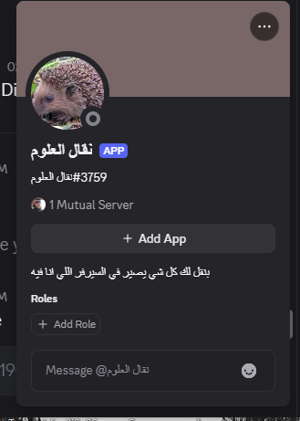
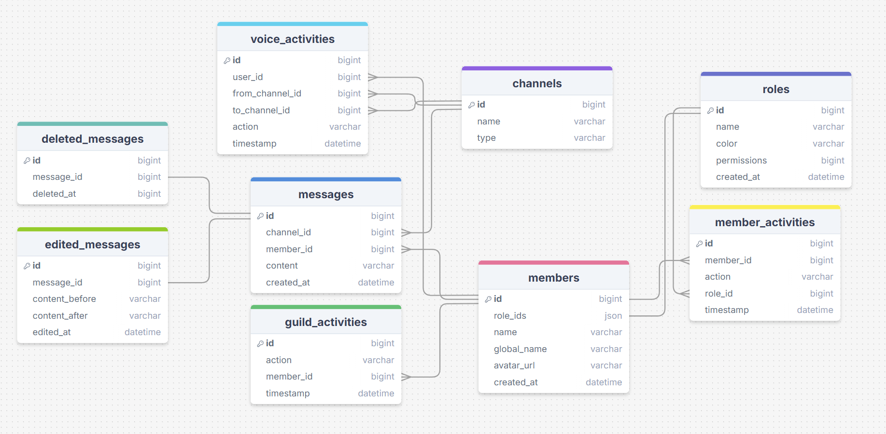
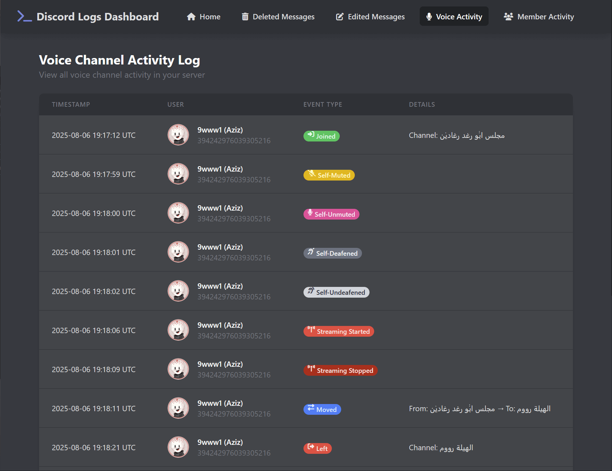

# Discrod Bot Logger

A bot that logs everything happening on your server

## About the Project

This is the source code for a **Discord bot** that **monitors and logs all activity** on your server. It stores every event in a **relational database**, and you can access a **user-friendly dashboard** to review the logs.

## What it monitors

- **Message**
    - Stores every message sent on the server
    - Tracks message edits and deletions
    - Saves deleted messages for audit purposes
- **Voice States** 
    - Logs who joined/left a voice channel
    - Tracks mute/unmute and deafen/undeafen events
- **Guild Members**
    - Logs every member who joined or left the guild
    - Records bans, kicks, and unbans of members
- **Role Changes**
    - Logs every role given or removed from members
- *More coming soon...*

## Database Architecture

Everything is stored in a relational database. Here's a visual representation of the schema:

## Dashboard

You can access a dashboard to view all your logs in a clean and intuitive way.

## Getting started

*To be written...*

## Technologies Used
- Python (with discord.py)
- SQLModel (for database operations)
- sqlite (or any relational database)
- Flask (for the dashboard)
